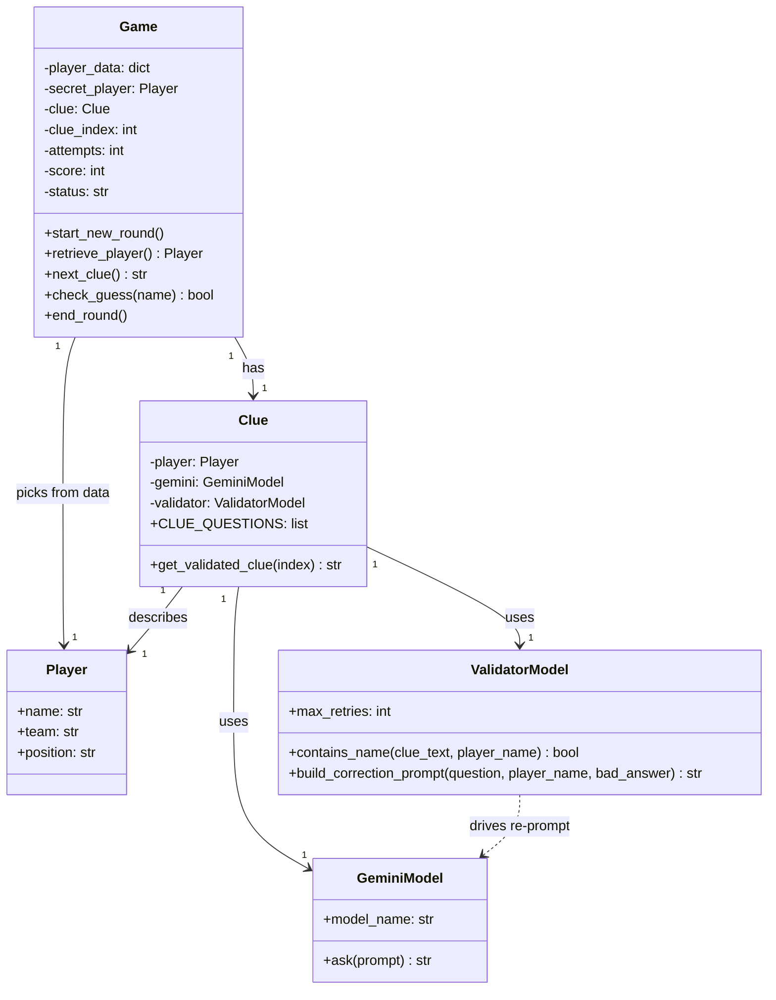
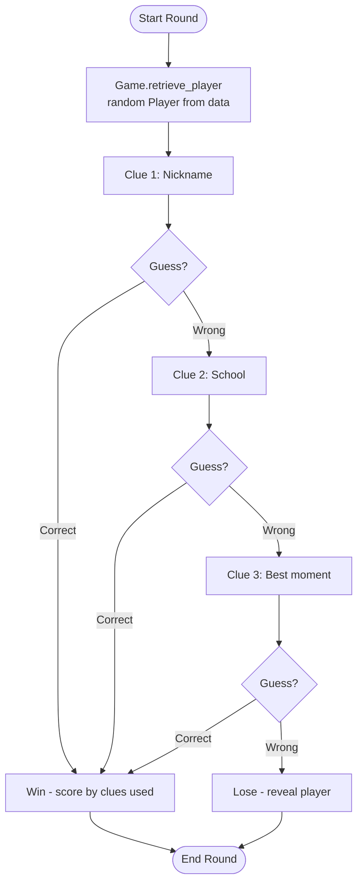
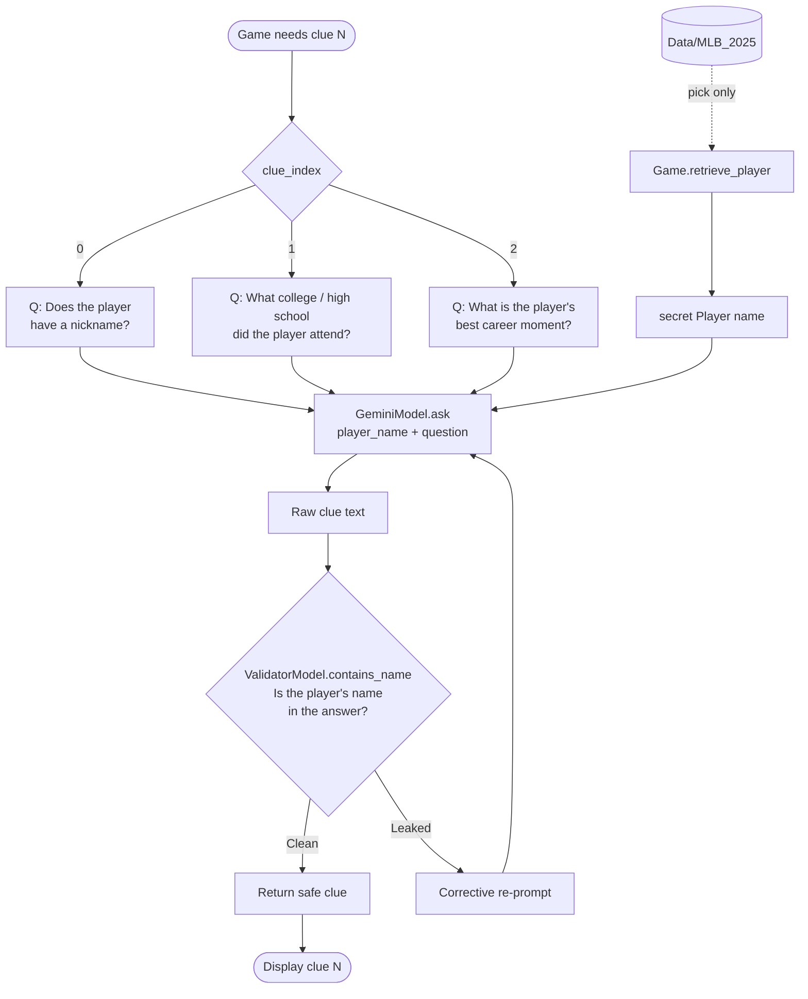
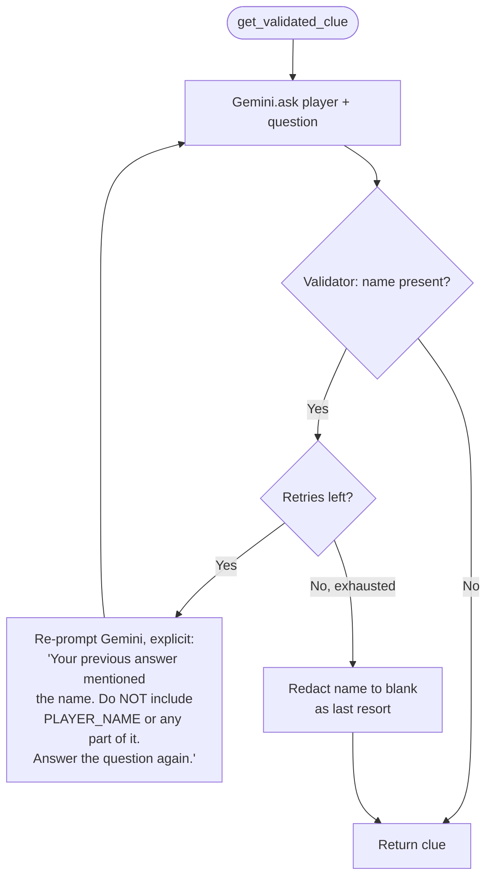

# MLB Player Guessing Game — Design

A guessing game where the player identifies a mystery 2025 MLB player from
AI-generated clues. The dataset (`Data/MLB_2025`) is used **only to pick** the
secret player — every clue comes from a Gemini model pulling facts from outside
our dataset. A validator model guards each clue so it never leaks the player's
name.

## Clues

Exactly **3 fixed clues** are revealed in order, one per wrong guess:

1. **Nickname** — "Does the player have a nickname?"
2. **School** — "What college or high school did the player attend?"
3. **Best moment** — "What is the player's best career moment?"

Three wrong guesses (all clues exhausted) ends the round as a loss.

## Class Structure

## Game Loop

The data only selects the player; all three clues are AI-generated.

## Clue Pipeline

Each clue is a fixed question sent to Gemini, then screened by the validator.

## Validator Corrective Loop

On a leak, the validator re-prompts Gemini with an **explicit** instruction
naming what leaked and forbidding it. A retry counter caps the loop, with
name-redaction as the final fallback so a round always resolves.

