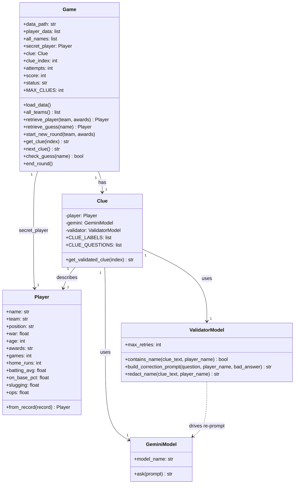
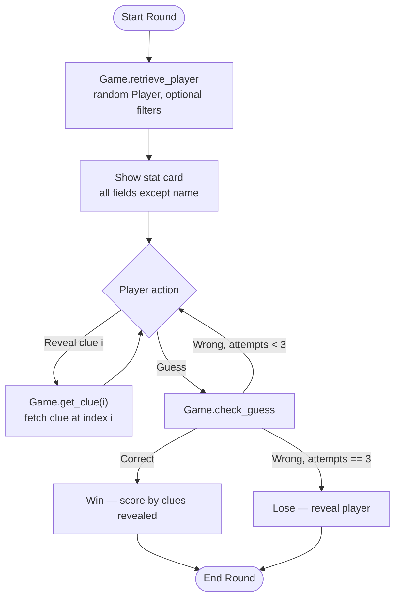
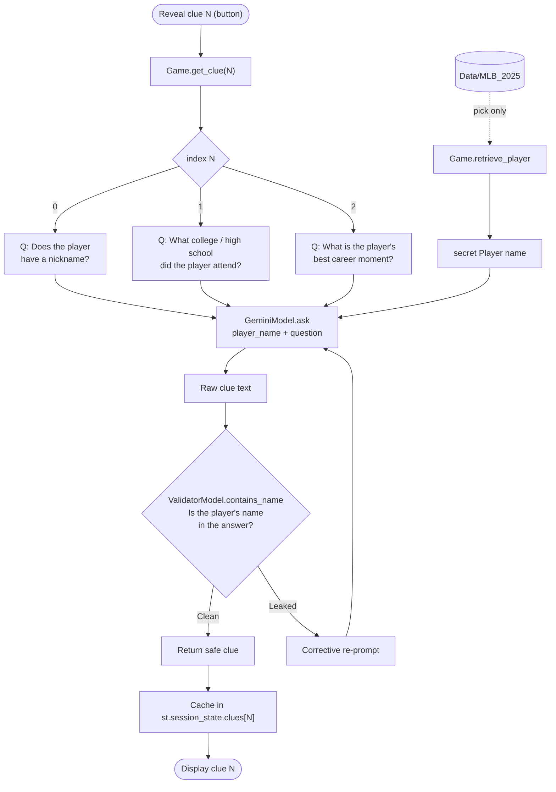
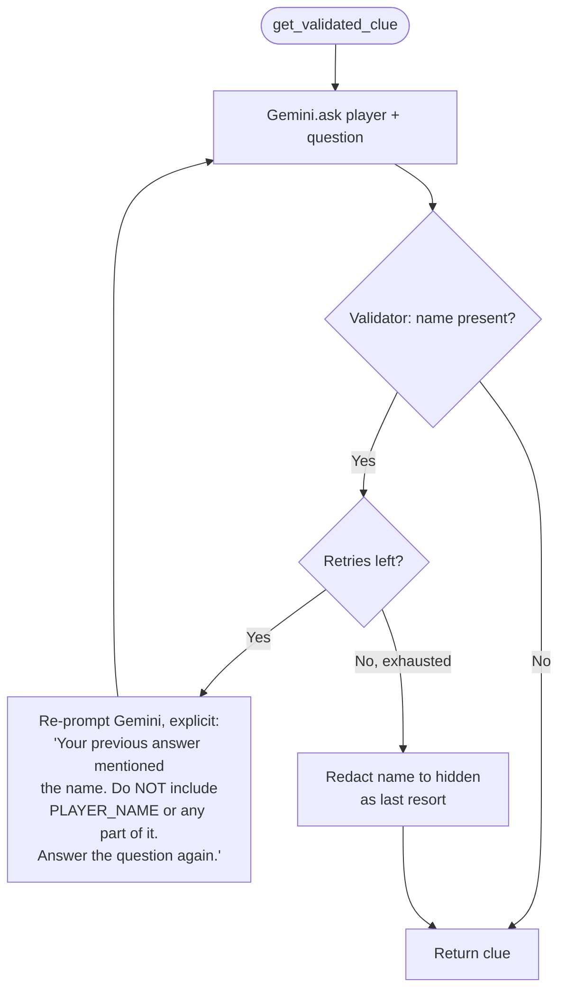

# MLB Player Guessing Game — Design

A guessing game where the player identifies a mystery 2025 MLB player. The
dataset (`Data/MLB_2025`) is used to **pick the secret player** and to show a
**stat card** of that player's season numbers. Three optional clues (nickname,
school, best moment) are generated on demand by a Gemini model pulling facts
from outside the dataset, and a validator model guards each clue so it never
leaks the player's name.

Two layers:

- **`game_models.py`** — all game logic (data, player, clue generation,
  validation, scoring). No UI dependencies.
- **`app.py`** — a thin Streamlit view over `Game`. Only session state and
  rendering; no game rules.

## Gameplay

1. A round starts with a random secret player (optionally filtered by team or
   All-Star status). The player's stats are shown immediately — **everything
   except the name** (team, position, age, WAR, games, HR, AVG, OBP, SLG, OPS,
   awards).
2. The user can **reveal up to 3 clues on demand**, in any order, each behind
   its own button:
   1. **Player Nickname**
   2. **College / High School**
   3. **Best Career Moment**
3. The user guesses via an autocomplete of all 2025 player names. Each guess is
   logged (name / team / position) under **Previous guesses**.
4. A correct guess wins. **Three wrong guesses** ends the round as a loss and
   reveals the player.

Clue reveals and guesses are **independent** — revealing a clue does not consume
a guess, and guessing does not auto-reveal a clue.

## Class Structure

`decode_name(name)` is a module-level helper used by `Player.from_record` to
normalize names that arrive as UTF-16 bytes (BOM-detected) or carry stray
surrogate code points.

## Data & Player Selection

`Data/MLB_2025` is a JSON object keyed by row id; `Game.load_data` flattens it
to a list of records and caches the sorted player names in `all_names` (used to
populate the guess autocomplete).

`retrieve_player(team, awards)` chooses the secret with optional filters:

- **team** — only players whose `Team` field contains the given code. A field
  may list several space-separated codes for a mid-season trade (e.g.
  `"BOS SFG"`), so matching is a substring check. `all_teams()` returns the
  sorted unique codes for the sidebar autocomplete.
- **awards** — only players with `"AS"` in their `Awards` field (All-Stars).

If no player matches, `retrieve_player` raises `ValueError`.

`retrieve_guess(name)` looks up a guessed player by name (case-insensitive) and
returns a `Player` **without** touching `secret_player` — it backs the
Previous-guesses log.

## Game Loop

The lose condition is **`attempts >= MAX_CLUES`** (three wrong guesses), tracked
independently of how many clues were revealed.

## Clue Pipeline

Each clue is a fixed question sent to Gemini, then screened by the validator.
Clues are fetched **by index on demand** (`get_clue`), not necessarily in order.

`GeminiModel` reads `API_KEY` / `GEMINI_MODEL` from a `.env` file and lazily
creates the `google.genai` client on first `ask`.

`next_clue()` (sequential fetch, advancing `clue_index`) still exists on `Game`
but the UI uses `get_clue(index)` so clues can be revealed in any order.

## Validator Corrective Loop

On a leak, the validator re-prompts Gemini with an **explicit** instruction
naming what leaked and forbidding it. A retry counter (`max_retries`, default 3)
caps the loop, with name-redaction as the final fallback so a round always
resolves.

## Scoring

Scoring is intended to reward guessing with **fewer clues revealed**
(`_score_for_clues_used`: `max(10, 100 - 30 * clues_used)`).

> **Known gap:** the score currently reads `clue_index`, which only advances in
> `next_clue()`. Because the UI reveals clues via `get_clue()` instead,
> `clue_index` stays at 0, so a win always scores the maximum. To make scoring
> reflect clues revealed, base it on the number of filled clue slots rather than
> `clue_index`.

## UI Layout (`app.py`)

- **Sidebar** — New Round filters: team autocomplete (`all_teams()`),
  All-Stars-only checkbox, and a "Start New Round" button.
- **Stat card** — the secret player's stats (all fields except the name).
- **Clues** — one reveal button per clue; revealed clues show under their label.
- **Previous guesses** — a table of name / team / position for each past guess.
- **Guess input** — autocomplete over `all_names`, submit button.
- **Developer Debug Info** — an expander exposing the secret player and state
  (debug-only; reveals the answer).

State lives in `st.session_state`: `game` (the `Game`), `clues` (per-index clue
cache), and `guesses` (list of guessed `Player`s).
